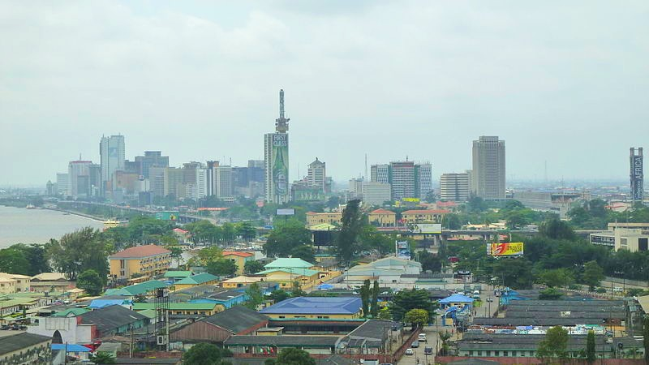

# Analyzing Lagos' Historic Weather Data (January to October 2024)

## I personally have an interest in using Python to analyze any structured data that I can get my hands on, and thus, the reason for this project. The weather in Lagos state this year has been an interesting narration of sweltering high and shivering low temperatures (though not as low as it is in nations in the northern hemisphere). Here, I showcase my webscraping, data modelling and analytical skills to visualize patterns in the weather for the common user to understand. 
